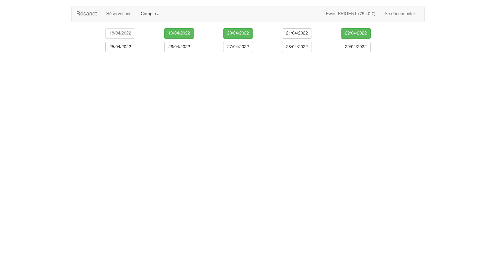

Resanet 
========================

Resanet – par [@Aaldn](https://github.com/Aaldn)

  

Application de gestion des réservations.

</img>

### Documentation

  * [Documentation utilisateur](docs/Documentation-Utilisateur.pdf) _(À venir)_
  * [Documentation technique](docs/Documentation-Technique.pdf) _(À venir)_

### Contexte

_À venir_

### Prérequis

  * [Python](https://www.python.org/downloads/)
  * [MariaDB](https://mariadb.org/download/?t=mariadb&o=true&p=mariadb&r=10.3.31&os=Linux&cpu=x86_64&i=systemd)

> En cas de difficulté, reportez-vous à la documentation officielle de [Python](https://docs.python.org/3/) et de [MariaDB](https://mariadb.com/kb/en/documentation/).

## Installation

_À venir_

## Licence

Voir le fichier [LICENSE.md](https://github.com/Aaldn/Resanet/blob/master/LICENSE.md) fourni.